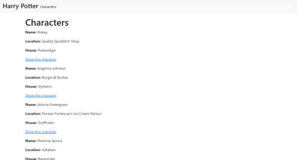

# Howarts Rails

howarts_rails es una aplicación web que muestra personajes de Harry Potter.

## Descripción

App que permite visualizar personajes de Harry Potter. Además de sus nombres muestra su locación y la casa a la que pertenece un mago de la película. Se hace uso del seeds incorporando en face inicial de prueba 10 personajes de forma aleatoria.

## Visuales



> Deployments: https://howarts-e7a7952f2a30.herokuapp.com/

## Empezando 🚀

Estas instrucciones te guiarán para obtener una copia de este proyecto en funcionamiento en tu máquina local para propósitos de desarrollo y pruebas.

### Prerrequisitos 📋

Lista de software y herramientas, incluyendo versiones, que necesitas para instalar y ejecutar este proyecto:

- Sistema Operativo (Ubuntu 22.04)
- Lenguaje de programación (ruby 3.2.2)
- Framework (Rails 7.0.7)
- Base de datos (PostgreSQL 14.8)
- Framework (Bootstrap 5.3)
- Git
- GitHub

### Instalación 🔧

Con estos pasos podrás instalar y ejecutar el proyecto localmente:

1. Clona este repositorio en tu máquina local.

```bash
git clone
git@github.com:alexandraguilarc/howarts_rails.git
```

2. Ingresa al directorio del proyecto.

```bash
cd howarts_rails
```
3. Crea las Bases de datos.

```bash
rails db:create
```
4. Realiza las migraciones.

```bash
rails db:migrate
```
5. Corre el seeds.

```bash
rails db:seed
```

## Despliegue 📦

Con estos pasos podrás desplegar el proyecto en un sistema en vivo o ambiente de producción usando Heroku:

1. Clona este repositorio en tu máquina local y subelo a tu repo.

```bash
git clone
git@github.com:alexandraguilarc/howarts_rails.git
```
2. Ingresa a tu cuenta de Heroku.
3. Selecciona New - Create new app.
4. Agrega el nombre de tu app y pulsa create new app.
5. En Deployment method seleccionas la opción GitHub (connect to GitHub).
6. Agregas el nombre de la app en tu repositorio y pulsas Search.
7. Aparece un botón connect, debes hacer clic.
8. Puedes hacer el deploy manual o automático, pulsas cialquiera de las opciones que te venga mejor y listo debe aparecer un mensaje como este: Your app was successfully deployed..
9. Haces clic en view.
10. Recuerda correr las migraciones y el seed desde la consola de Heruku.

## Construido Con 🛠️

- [Ruby](https://www.ruby-lang.org/es/) - El lenguaje utilizado
- [Ruby on Rails](https://rubyonrails.org) - El framework web utilizado
- [Ruby gems](https://rubygems.org) - Gestión de dependencias
- [Postgresql](https://www.postgresql.org) - Sistema de base de datos
- [Bootstrap](https://getbootstrap.com/) - Framework de CSS

## Contribuyendo 🖇️

Este proyecto es de código abierto y las contribuciones son bienvenidas. Siente la libertad de enviar tus pull requests para colaborar en mejorar el diseño y agregado de nuevas funcionalidades.

## Versionado 📌

Usamos [Git](https://git-scm.com) para el versionado. Para las versiones disponibles, ve las [etiquetas en este repositorio](https://github.com/alexandraguilarc/howarts_rails).

## Autores ✒️

- **Alexandra Aguilar** - _Trabajo inicial_ - [Alexandra Aguilar](https://github.com/alexandraguilarc)


---

Saludos, con ❤️ por [Alexandra Aguilar](https://github.com/alexandraguilarc) 😊